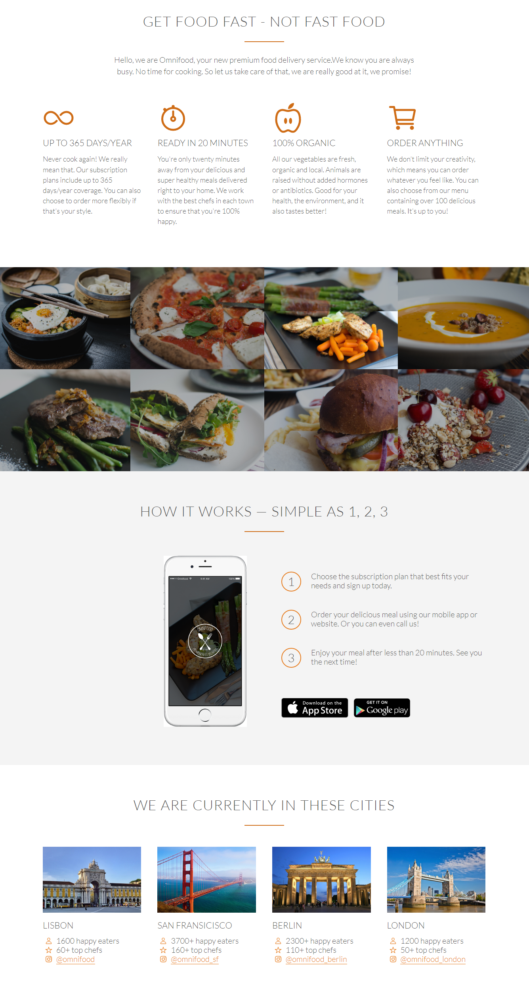
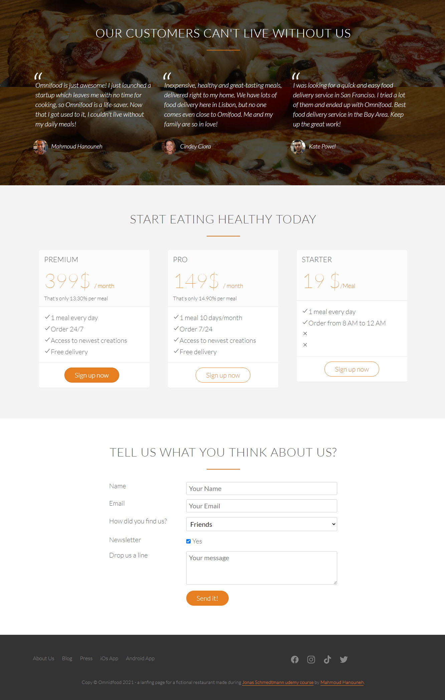

# OMNIFOOD - Fictional restaurant landing page

This is a simple website (Landing Page) for a fictional restaurant created for educational purposes.

## Table of contents

- [Overview](#overview)
  - [Screenshot](#screenshot)
  - [Links](#links)
- [My process](#my-process)
  - [Built with](#built-with)
  - [Useful resources](#useful-resources)
- [Author](#author)

## Overview

### Screenshot

### Links

- Live Site URL: (https://omnifood-mu.vercel.app/)

## My process

### Built with

- Semantic HTML5 markup
- CSS custom properties
- Responsive Grid System
- responsiveness with Media Queries
- Waypoints jQuery

### Useful resources 

- [Waypoints iQuery](https://medium.com/@aniapienio/easy-waypoints-just-add-jquery-21e423068867)
- [Responsive Grid System](http://www.responsivegridsystem.com/)

## Author

Mahmoud Hanouneh, I am a telecommunication engineer with a passion for learning web develop.

- LinkedIn - [Mahmoud Hanouneh](https://www.linkedin.com/in/mahmoud-hanouneh/)

